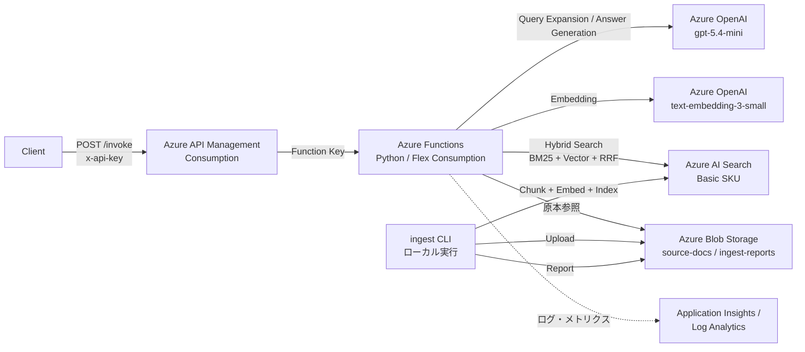

# Query Expansion RAG on Azure

## 概要

このプロジェクトは、Azure Developer CLI (azd) と Bicep を利用して、Azure OpenAI と Azure AI Search を活用した**クエリ拡張型 RAG (Retrieval-Augmented Generation) API** をデプロイするためのテンプレートです。

[`aws/query-expansion-rag`](../../aws/query-expansion-rag) を Azure に移植したリファレンス実装です。AWS Bedrock Knowledge Base 相当の機能を、Azure OpenAI + Azure AI Search + Azure Functions + Azure API Management の組み合わせで実現しています。

主な特徴は以下の通りです。

- `azd up` 一回で API エンドポイント・取り込みパイプライン・監視基盤までまとめてデプロイできます。
- クエリ拡張、ハイブリッド検索、関連性評価、回答生成といった一連の RAG 処理を Azure Functions で実装しています。
- 取り込み (ingest) は CLI で完結し、PDF (規約) と Excel (Q&A) の両方を扱えます。
- Azure API Management (Consumption) で `x-api-key` 認証付きの単一エンドポイントを提供します。

## アーキテクチャ



1. **Azure API Management (APIM)**: 外部からのリクエストを受け付け、`x-api-key` ヘッダーで認証します。APIM の Named Value 経由で Function キーを保持し、バックエンド呼び出し時に付与します。
2. **Azure Functions (Python)**: HTTP トリガーで `/invoke`, `/health`, `/ingest-status` を提供します。RAG 処理 (クエリ拡張 → ハイブリッド検索 → 関連性評価 → 回答生成) を実装しています。
3. **Azure OpenAI**: クエリ拡張・関連性評価・回答生成に Chat モデル、ドキュメント検索に Embedding モデルを使用します。
4. **Azure AI Search**: BM25 と Vector を組み合わせたハイブリッド検索 (RRF マージ) を提供します。
5. **Azure Blob Storage**: 取り込み元の原本ファイルと、取り込みレポート (JSON) を保管します。
6. **ingest CLI**: ローカルから実行する取り込みツール。Blob アップロード、検証、章節 chunking、Embedding、AI Search 投入を行います。

## プロジェクト構造

```
azure/query-expansion-rag/
├─ azure.yaml                       # azd エントリ
├─ infra/                           # Bicep
│  ├─ main.bicep                    # サブスクリプションスコープのエントリ
│  ├─ main.parameters.json          # デプロイ時のパラメータ
│  ├─ abbreviations.json            # リソース命名規約
│  ├─ app/
│  │  ├─ storage.bicep              # Blob (source-docs, ingest-reports)
│  │  ├─ openai.bicep               # Azure OpenAI + Chat / Embedding デプロイ
│  │  ├─ ai-search.bicep            # Azure AI Search (Basic SKU)
│  │  ├─ function.bicep             # Azure Functions (Flex Consumption)
│  │  ├─ apim.bicep                 # APIM (Consumption)
│  │  ├─ apim-api.bicep             # API 定義・Subscription
│  │  ├─ apim-api-policy.xml        # APIM ポリシー (x-api-key → Function Key 変換)
│  │  └─ rbac.bicep                 # Function MI → AOAI/Search/Storage の RBAC
│  └─ core/monitor/
│     └─ monitoring.bicep           # Log Analytics + Application Insights
├─ app/                             # Azure Functions (Python)
│  ├─ function_app.py               # HTTP トリガ (/health, /invoke, /ingest-status)
│  ├─ requirements.txt              # Function ランタイム依存
│  ├─ host.json
│  ├─ local.settings.json.example   # ローカル実行時の設定例
│  ├─ .funcignore
│  ├─ rag/                          # RAG パイプライン
│  │  ├─ pipeline.py                # クエリ拡張 → 検索 → 評価 → 回答生成 のオーケストレーション
│  │  ├─ query_expansion.py         # 元クエリから n 個の拡張クエリ生成
│  │  ├─ search.py                  # AI Search ハイブリッド検索ラッパ
│  │  ├─ retrieve_and_rating.py     # 並列検索 + LLM による関連性評価
│  │  ├─ answer_generation.py       # 引用付き回答 + チャンク本文の原文表示
│  │  ├─ aoai_client.py             # Azure OpenAI クライアント
│  │  ├─ prompts.py                 # システムプロンプト
│  │  └─ config.py                  # 環境変数読み込み
│  └─ ingest/                       # 取り込みパイプライン + CLI
│     ├─ cli.py                     # `python -m ingest.cli ...` のエントリ
│     ├─ pipeline.py                # 検証 → chunk → embed → index 投入
│     ├─ requirements.txt           # CLI 専用依存 (Function ランタイムには含めない)
│     ├─ loaders/                   # PDF / Excel ローダー
│     │  ├─ pdf.py
│     │  └─ excel.py
│     ├─ chunkers/                  # 章節 / QA の chunker
│     │  ├─ section_chunker.py      # 「第N条」で分割、検出失敗時は page fallback
│     │  └─ qa_chunker.py           # 1 行 1 chunk
│     ├─ embedder.py                # Azure OpenAI Embedding 呼び出し
│     ├─ blob_store.py              # Blob 入出力
│     ├─ search_client.py           # AI Search インデックス管理
│     ├─ validators.py              # 拡張子・サイズ・MIME 検証
│     ├─ quarantine.py              # 失敗ファイルの隔離
│     ├─ report.py                  # 取り込みレポートの生成
│     ├─ errors.py                  # ローダー固有の例外
│     ├─ types.py                   # データクラス
│     └─ config.py                  # 環境変数読み込み
└─ scripts/
   └─ grant-user-rbac.sh            # ローカル実行ユーザーに RBAC を付与する補助スクリプト
```

## デプロイ手順

### 1. 前提条件

以下のツールをインストールしてください。

- [Azure Developer CLI (azd)](https://learn.microsoft.com/azure/developer/azure-developer-cli/install-azd)
- [Azure CLI](https://learn.microsoft.com/cli/azure/install-azure-cli)
- Python 3.11 以上
- gpt-5.4-mini Global Standard のクォータが確保された Azure サブスクリプション

### 2. リソースプロバイダーの登録

使用する Azure サブスクリプションで、以下のリソースプロバイダーが「登録済み」になっていることを確認してください。

- `Microsoft.Web`
- `Microsoft.Storage`
- `Microsoft.CognitiveServices`
- `Microsoft.Search`
- `Microsoft.ApiManagement`
- `Microsoft.Insights`
- `Microsoft.OperationalInsights`

未登録のものは Azure Portal の **サブスクリプション > リソースプロバイダー** から登録してください。

### 3. パラメータの設定

デプロイに必要なパラメータは `infra/main.parameters.json` に集約されています。主なパラメータは以下の通りです。

| 名前 | 型 | 必須 | 内容説明 | デフォルト値 |
|------|----|------|----------|--------------|
| `environmentName` | string | Yes | `azd env new` で指定する環境名。`rg-<environmentName>` 形式でリソースグループを作成します。 | (azd 引数で指定) |
| `location` | string | Yes | リソース全体を作成する Azure リージョン。 | (azd 引数で指定) |
| `openAiLocation` | string | No | Azure OpenAI のリージョン。`location` と分離可能 (Chat モデルの提供リージョンに合わせます)。 | `eastus2` |
| `openAiChatModelName` | string | No | Chat モデル名。 | `gpt-5.4-mini` |
| `openAiChatModelVersion` | string | No | Chat モデルのバージョン。 | `2026-03-17` |
| `openAiChatDeploymentSku` | string | No | Chat モデルのデプロイ SKU。`GlobalStandard` 等。 | `GlobalStandard` |
| `openAiChatDeploymentCapacity` | integer | No | Chat モデルの TPM クォータ (×1000)。 | `50` |
| `openAiEmbeddingModelName` | string | No | Embedding モデル名。 | `text-embedding-3-small` |
| `openAiEmbeddingModelVersion` | string | No | Embedding モデルのバージョン。 | `1` |
| `openAiEmbeddingDeploymentSku` | string | No | Embedding モデルのデプロイ SKU。 | `Standard` |
| `openAiEmbeddingDeploymentCapacity` | integer | No | Embedding モデルの TPM クォータ (×1000)。 | `50` |
| `searchSku` | string | No | Azure AI Search の SKU。`free` / `basic` / `standard` 等。 | `basic` |
| `apimSku` | string | No | APIM の SKU。`Consumption` / `Developer` / `Standard` 等。 | `Consumption` |
| `apimPublisherEmail` | string | No | APIM の発行者メールアドレス。 | `admin@example.com` |
| `apimPublisherName` | string | No | APIM の発行者表示名。 | `Query Expansion RAG` |
| `apiAllowedSourceIps` | array | No | APIM へのアクセスを許可する送信元 IP の配列。空配列の場合は IP 制限なし。 | `[]` |

> **Note:** Global Standard デプロイの Chat モデルは、推論データが複数リージョンを跨ぐ可能性があります。規約や個人情報を扱う本番運用前に、データ取扱方針を必ず確認してください。

### 4. デプロイの実行

```bash
# ログイン (azd と Azure CLI の両方)
azd auth login
az login

# 環境名を決めて初期化
azd env new dev

# 一括デプロイ (Bicep プロビジョニング + Function コードデプロイ + postprovision フック)
azd up
```

`azd up` は以下を順に実行します。

1. Bicep でリソース群をプロビジョニング (初回は APIM の作成に 30〜45 分かかります)
2. Function App に Python コードをデプロイ
3. postprovision フックで Function キーを取得し、APIM の Named Value `function-app-key` に登録

完了後、出力される `apiEndpoint` をメモしてください。

### 5. APIM サブスクリプションキーの取得

APIM の `x-api-key` ヘッダーに使うサブスクリプションキーは、Azure Portal から取得します。

1. Azure Portal で対象の **API Management サービス** を開く
2. 左メニュー **API > サブスクリプション** を選択
3. 既存のサブスクリプション (`built-in-all-api` 等) の **Primary key** または **Secondary key** を表示・コピー

### 6. 疎通確認

```bash
# 環境変数にエンドポイントとキーを設定
export API_ENDPOINT=$(azd env get-value API_ENDPOINT)
export API_KEY="<上記で取得した APIM サブスクリプションキー>"

# /health
curl "${API_ENDPOINT}/health" -H "x-api-key: ${API_KEY}"

# /invoke (この時点では index が空なので「該当情報なし」の応答)
curl -X POST "${API_ENDPOINT}/invoke" \
  -H "Content-Type: application/json" \
  -H "x-api-key: ${API_KEY}" \
  -d '{"inputs": {"input_text": "テスト質問"}}'
```

## ingest パイプライン

規約 PDF や Q&A Excel を Blob Storage に投入し、検証 → chunking → Embedding → AI Search 投入を行う CLI です。

### 初回セットアップ

```bash
# 1. 自分のユーザーに必要な RBAC を付与 (Storage / AI Search / Azure OpenAI へのアクセス権)
bash scripts/grant-user-rbac.sh

# 2. Python 仮想環境を作って依存をインストール
cd app
python3 -m venv .venv
source .venv/bin/activate
pip install -r ingest/requirements.txt

# 3. azd 環境から環境変数を取り込み
export AZURE_STORAGE_ACCOUNT=$(cd .. && azd env get-value AZURE_STORAGE_ACCOUNT)
export AZURE_OPENAI_ENDPOINT=$(cd .. && azd env get-value AZURE_OPENAI_ENDPOINT)
export AZURE_OPENAI_EMBEDDING_DEPLOYMENT=$(cd .. && azd env get-value AZURE_OPENAI_EMBEDDING_DEPLOYMENT)
export AZURE_SEARCH_ENDPOINT=$(cd .. && azd env get-value AZURE_SEARCH_ENDPOINT)
export AZURE_SEARCH_INDEX_NAME=$(cd .. && azd env get-value AZURE_SEARCH_INDEX_NAME)

# 4. AI Search インデックスを作成 (一度だけ)
python -m ingest.cli init
```

### CLI コマンド

| コマンド | 説明 |
|---|---|
| `python -m ingest.cli init` | AI Search インデックスを作成 (存在しなければ) |
| `python -m ingest.cli upload <local_path> [--blob-path <path>]` | ローカルファイルを Blob (`source-docs/`) にアップロード |
| `python -m ingest.cli add <blob_path>` | Blob 上のファイルを取り込み (検証 → chunk → embed → index) |
| `python -m ingest.cli delete <blob_path>` | index から該当ファイルの全 chunk を削除 |
| `python -m ingest.cli sync [<prefix>]` | Blob と index を差分同期 (Blob にあって index にないものを追加、Blob から消えたものを index から削除) |
| `python -m ingest.cli status` | 直近の取り込みレポート (`ingest-reports/latest.json`) を表示 |

### 投入ファイルの命名規則

```
source-docs/
├─ rules/                   ← マニュアル・規程・ガイドライン類 (章節 chunking)
│  └─ sample.pdf
└─ qa/                      ← Q&A 形式のドキュメント (1 行 1 chunk)
   └─ sample.xlsx
```

Blob パスのトップディレクトリで `doc_type` を判定します。

- `rules/*` → `doc_type=rules`
- `qa/*` → `doc_type=qa`

### 失敗時の挙動

- 検証エラー (拡張子偽装、サイズ超過、MIME 不一致) やローダーエラー (パスワード保護、破損 PDF) は **個別ファイル単位で捕捉**
- 失敗ファイルは `quarantine/<run_id>/<元パス>` に移動し、エラー情報を Blob メタデータに記録
- 全体の取り込み結果は `ingest-reports/<run_id>.json` と `ingest-reports/latest.json` に保存

## API の利用方法

### 共通認証

すべてのエンドポイントで、HTTP リクエストヘッダーに APIM サブスクリプションキーを指定します。

- **Key:** `x-api-key`
- **Value:** APIM のサブスクリプションキー

### エンドポイント 1: `POST /invoke`

#### 概要

ユーザーの質問を受け取り、AI Search からドキュメントを取得して引用付きの回答を返します。

- **Method:** `POST`
- **URL:** `{apiEndpoint}/invoke`

#### リクエスト形式

| 名前 | 型 | 必須 | 内容説明 |
|---|---|---|---|
| `inputs.input_text` | string | Yes | ユーザーの質問テキスト |

#### リクエスト例

```bash
curl -X POST "${API_ENDPOINT}/invoke" \
  -H "Content-Type: application/json" \
  -H "x-api-key: ${API_KEY}" \
  -d '{"inputs": {"input_text": "シングルサインオンの設定方法を教えてください"}}'
```

#### レスポンス形式

| フィールド | 型 | 説明 |
|---|---|---|
| `statusCode` | number | HTTP ステータス相当 (200 / 500) |
| `outputs` | string | Markdown 形式の回答 (本文 + `[出典N]` + 参考情報リスト + 各出典のチャンク本文) |
| `artifacts` | array | 添付ファイル (現状空配列、将来拡張用) |
| `references` | array | 引用された出典のリスト (`{number, source_path, source_locator, title, section, page}`) |
| `debug` | object | クエリ拡張結果、ヒット数、各処理の経過秒数など |

#### レスポンス例

```json
{
  "statusCode": 200,
  "outputs": "シングルサインオンの設定は、次の手順で行います。\n\n1. 管理画面の「認証設定」を開く\n2. Identity Provider を選択する\n3. メタデータ URL を登録する\n4. 属性マッピングを設定し保存する\n\n詳細は本マニュアル「3.2 SSO 設定」を参照してください。[出典1]\n\n**参考情報:**\n- [出典1] rules/sample.pdf / 3.2 SSO 設定 / p.14\n\n---\n\n### 参考した文書\n\n#### [出典1] rules/sample.pdf / 3.2 SSO 設定 / p.14\n\n> ## 3.2 SSO 設定\n>\n> 1. 管理画面の「認証設定」を開きます。\n> 2. プルダウンから利用する Identity Provider を選択します。\n> 3. メタデータ URL を貼り付け、「読み込み」を押下します。\n> 4. 属性マッピングを設定し、「保存」を押下します。",
  "artifacts": [],
  "references": [
    {"number": 1, "source_path": "rules/sample.pdf", "source_locator": "section=3.2", "title": "3.2 SSO 設定", "section": "3.2 SSO 設定", "page": 14}
  ],
  "debug": {
    "version": "0.3.0",
    "queries": ["シングルサインオンの設定方法を教えてください", "SSO 設定 手順", "Identity Provider 登録 方法", "認証設定 マニュアル"],
    "n_hits": 11,
    "n_kept": 6,
    "elapsed_seconds": {"total": 7.12, "query_expansion": 2.10, "retrieve": 1.20, "rate_relevance": 2.00, "answer_generation": 1.82}
  }
}
```

### エンドポイント 2: `GET /health`

疎通確認用。Function の稼働状態と環境変数の設定状況を返します。

- **Method:** `GET`
- **URL:** `{apiEndpoint}/health`

#### レスポンス例

```json
{
  "status": "ok",
  "version": "0.3.0",
  "timestamp": "2026-05-16T09:33:09.767133+00:00",
  "config": {
    "aoai_endpoint_configured": true,
    "aoai_chat_deployment": "gpt-5.4-mini",
    "aoai_embedding_deployment": "text-embedding-3-small",
    "search_endpoint_configured": true,
    "search_index_name": "rag-index",
    "storage_account": "st...",
    "source_container": "source-docs"
  }
}
```

### エンドポイント 3: `GET /ingest-status`

`ingest-reports/latest.json` を Markdown に整形して返します。直近の取り込み結果を確認できます。

- **Method:** `GET`
- **URL:** `{apiEndpoint}/ingest-status`

#### レスポンス例

```json
{
  "statusCode": 200,
  "outputs": "## 取り込み状況\n\n- 実行 ID: `20260516T071736Z`\n- 開始: 2026-05-16T07:17:36+00:00\n- 完了: 2026-05-16T07:17:44+00:00\n\n### 集計\n- 追加: **0**\n- 更新: **1**\n- 削除: **0**\n- 失敗: **0**\n\n### 実行内容\n- `update` rules/sample.pdf (61 chunks)",
  "debug": {"version": "0.3.0"}
}
```

## IP アドレス制限の設定

APIM へのアクセスを送信元 IP で制限する場合、azd の環境変数 `AZURE_API_ALLOWED_SOURCE_IPS` に許可する IP アドレス (CIDR 形式) を **CSV** で渡します。

```bash
# 1 つだけ
azd env set AZURE_API_ALLOWED_SOURCE_IPS "203.0.113.42/32"

# 複数 (CSV、カンマ区切り、空白可)
azd env set AZURE_API_ALLOWED_SOURCE_IPS "203.0.113.42/32,198.51.100.10/32,192.0.2.0/24"

# 反映
azd provision
```

設定後、APIM の API ポリシーに `<ip-filter action="allow">` セクションが自動生成され、指定した IP 以外からのアクセスは `403 Forbidden` で拒否されます。

未設定 or 空文字 (デフォルト) の場合は IP 制限なしとなり、APIM サブスクリプションキー (`x-api-key`) のみで認証します。

### 値の保存場所

`azd env set` で設定した値は `.azure/<env>/.env` に保存され、`.gitignore` で除外されています。
`infra/main.parameters.json` には `${AZURE_API_ALLOWED_SOURCE_IPS=}` という参照だけが書かれているので、公開リポジトリに自宅 IP 等を直接コミットすることはありません。

### 注意点

- APIM の `<ip-filter>` の `<address>` 要素は **単一 IP のみサポート** (CIDR 非対応)。Bicep で `/32` 等のプレフィックスは自動で除去しますが、`/24` のような実質的な範囲指定は単一 IP に丸められます。範囲指定したい場合は `<address-range from="..." to="..." />` への対応が別途必要です。
- APIM の `ip-filter` は `X-Forwarded-For` ヘッダーよりも実 TCP 接続元 IP を優先します。CDN や前段プロキシ経由の場合は、それらの egress IP を allowlist に含めてください。

## デプロイ時のよくあるハマりどころ

| 症状 | 原因 | 対処 |
| --- | --- | --- |
| `azd up` が APIM 作成で 30〜45 分待たされる | APIM Consumption の初回プロビジョニングが遅い | 待つ。タイムアウト時は `azd provision` で再開 |
| `azd deploy` が `403 Forbidden` (Function package pull 時) | Storage の RBAC が伝播していない | 5〜10 分待って `azd deploy` を再実行 |
| AOAI デプロイで `InvalidResourceProperties: model not available` | `openAiLocation` が指定モデル未提供リージョン | `main.parameters.json` の `openAiLocation` を East US 2 / Sweden Central / South Central US / Poland Central 等のサポートリージョンに変更 |
| AOAI クォータ不足 | Chat モデルの TPM クォータ不足 | Azure Portal > AOAI > Quotas で必要 TPM を確保。`openAiChatDeploymentCapacity` を小さくして暫定対応も可 |
| APIM 経由で 401 が返る | postprovision フックで Function キーの Named Value 更新が走っていない | `azd hooks run postprovision` を再実行、または手動で APIM Named Value `function-app-key` を Function キーで更新 |
| ingest CLI が `403 AuthorizationPermissionMismatch` を返す | ローカル実行ユーザーへの RBAC 未付与 | `bash scripts/grant-user-rbac.sh` を実行 |

## 環境の削除

```bash
azd down --purge
```

`--purge` を付けることで、Azure OpenAI と APIM のソフトデリート状態もまとめてパージします (同名のリソースを後で再作成する際に問題になりにくい)。

> **Warning:** この操作は元に戻せません。実行前に削除対象のリソースを十分に確認してください。

## 既知の制限

- 閉域構成 (VNet + Private Endpoint) には未対応です。本番運用時は AOAI / AI Search / Function / Storage を Private Endpoint で閉域化してください。
- Application Insights のメトリクス・アラートは未設定です。SLO に応じて別途構成してください。
- 顧客管理キー (CMK) には未対応です。Storage / AOAI / AI Search を CMK 化する場合は Bicep を拡張してください。

## 今後の改善候補

- プロンプト TOML 化 (規約 / QA 別の system プロンプトを外部ファイルで管理)
- 引用箇所への PDF 直接リンク (Storage SAS URL + `#page=N` フラグメント)
- ページ分割 PDF の生成 (モバイル PDF ビューア互換性向上)
- 閉域構成・CMK・監視アラートの追加

## 謝辞

本実装は、デジタル庁が公開する [`aws/query-expansion-rag`](../../aws/query-expansion-rag) のリファレンス実装をベースに、Azure マネージドサービスへ移植したものです。AWS 版を設計・公開してくださった皆様に深く感謝申し上げます。
